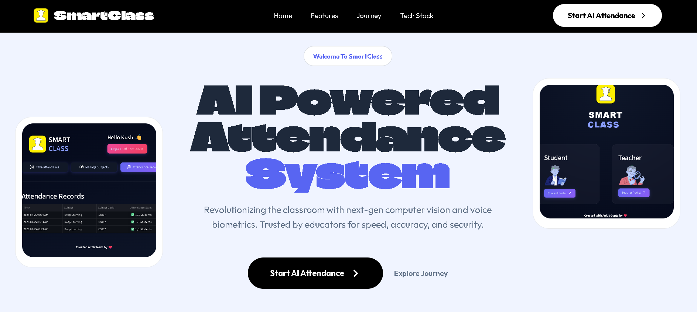

# 🚀 SmartClass AI – Landing Page Showcase

A modern AI-powered classroom management system landing page that highlights intelligent attendance solutions using Face Recognition and Voice Processing.

🔗 **Live Demo:** https://smartclass-gamma.vercel.app

---

## ✨ Overview

This project focuses on building a clean, responsive, and professional landing page for **SmartClass AI**, showcasing features, use cases, and core AI capabilities.
It is designed to present the product idea clearly to users, recruiters, and stakeholders.

---

## 🖥️ Landing Page Highlights

* ⚡ Clean and modern UI
* 📱 Fully responsive design
* 🎯 Clear product storytelling
* 🚀 Fast loading performance
* 🧠 AI-focused feature sections
* 🎨 Smooth layout and visual hierarchy

---

## 🛠️ Tech Stack

### Frontend

* HTML5
* CSS3
* JavaScript
* Flask 

### Framework / Deployment

* Vercel (for hosting)

### Design

* Responsive Design Principles
* UI/UX Optimization

---

### 🔹 Landing Page View



* Hero Section
* Features Section
* About / Use Case Section
* Contact / CTA Section

---

## 📂 Project Structure

```
smartclass-landing/
│
├── index.html
├── style.css
├── script.js
├── assets/
│   ├── images/
│   └── icons/
└── README.md
```

---


## 🎯 Purpose

This project demonstrates:

* Frontend development skills
* UI/UX design understanding
* Ability to present AI-based products effectively
* Clean project structuring for production-ready apps

---

## 🔮 Future Enhancements

* Add animations (Framer Motion / GSAP)
* Integrate backend APIs
* Convert into full-stack app
* Add authentication & dashboard

---

## 👨‍💻 Author

Ankit Gupta
B.Tech CSE | AI/ML Enthusiast

---

## ⭐ Show Support

If you like this project, give it a ⭐ on GitHub!
